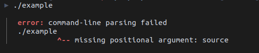
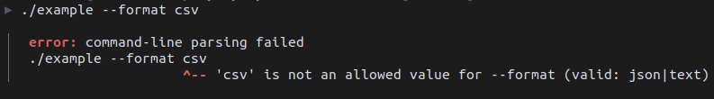
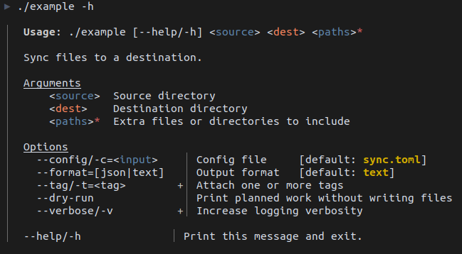

# cmdline

`cmdline` is a C++20/23/26 command-line parser where the usage text is the
source of truth. You write a small help-like specification, `cmdline` checks it
at compile time, then uses it at runtime to parse `argv`, print usage, and
report errors. Because the spec is parsed at compile time, the runtime result
has real typed accessors for command-line values instead of a bag of strings.

The simplest use case is intentionally direct: include `cmdline.h`, write a
spec, parse `argc` and `argv`, then read arguments and options by name. The
return types are derived from the spec, so `opt<"--verbose">()` can be an
`int`, `arg<"paths">()` can be a `std::vector<std::string>`, and
`opt<"--port">()` can be a custom C++ type.

NOTE: Currently alpha, the API may change to accomodate missing features.

## Getting Started

```cpp
#include <string>
#include <vector>

#include "cmdline.h"

int main(int argc, const char* argv[]) {
    auto cmdline = cmd::parse_cmdline<R"(
        Sync files to a destination.

        _Arguments
          <source>  Source directory
          <dest>    Destination directory
          <paths>*  Extra files or directories to include

        _Options
          --config/-c=          Config file [env: SYNC_CONFIG] [default: sync.toml]
          --format=[json|text]  Output format [default: text]
          --tag/-t=<tag>+       Attach one or more tags
          --dry-run             Print planned work without writing files
          --verbose/-v+         Increase logging verbosity
    )">(argc, argv);

    const std::string& source = cmdline.arg<"source">();
    const std::string& dest = cmdline.arg<"dest">();
    const std::vector<std::string>& paths = cmdline.arg<"paths">();

    const std::string& config = cmdline.opt<"--config">();
    const std::string& format = cmdline.opt<"--format">();
    const std::vector<std::string>& tags = cmdline.opt<"--tag">();

    bool dry_run = cmdline.opt<"--dry-run">();
    int verbosity = cmdline.opt<"-v">();

    return sync_files(
        source, dest, paths, config, format, tags, dry_run, verbosity);
}
```

That gives you all of this from one spec:

- `./sync src dst`
- `./sync --dry-run -vv src dst one.txt two.txt`
- `./sync -c sync.toml --tag nightly src dst`
- `./sync --help`
- Compile-time errors for malformed specs and misspelled accessors
- Runtime diagnostics for malformed command lines

If the user's command line does not match the spec, `parse_cmdline` prints a
diagnostic and exits. That includes missing positional arguments, unknown
options, repeated non-repeatable options, invalid choices, bad typed values,
missing option values, and extra positional values:



The same diagnostic format points at a bad option value:



`--help` is generated from the same spec:



Malformed specs fail when you compile. In C++20/23 the compiler can report the
line, column, and error category through the instantiated diagnostic type. In
C++26, `static_assert` can use a generated message, so you get source context
with a caret:

```text
error: static assertion failed due to requirement
'kAlwaysFalse<cmd::SpecErrorAt<4, 26, cmd::ParseError::kEmptyChoiceValue>>':

Invalid command-line specification:
line 4, column 26: choice value cannot be empty


        _Options
          --format=[json|]  Output format
                         ^-- choice value cannot be empty
```

For CMake projects in this repository:

```cmake
add_subdirectory(cmdline)
target_link_libraries(my_tool PRIVATE cmdline)
```

`cmdline` expects `{fmt}` to be available as a CMake package. On Debian and
Ubuntu, install `libfmt-dev`. Tests also need `libgtest-dev`. If you integrate
the header manually, compile as C++20/23 or C++26 and link `{fmt}`. If your
standard library does not provide `<expected>`, put TartanLlama `expected.hpp`
next to `cmdline.h`.

## The Spec

A spec is ordinary text with a small amount of markup. Common leading
indentation is removed, and one leading blank line is ignored so raw strings can
start cleanly on their own line. After that, blank lines and manual indentation
are preserved in generated usage.

Raw text is copied to the usage output. Lines starting with `_` are display
headings, with the `_` stripped before printing. Headings do not create nested
sections or sorting rules.

```cpp
constexpr char kSpec[] = R"(
    publish assets into a release directory.

    _Arguments
      <project>  Project root
      <assets>+  Assets to publish

    _Options
      --dry-run      Print planned work without writing files
      --verbose/-v+  Increase logging verbosity
)";
```

Names are ASCII identifiers. They may contain letters, digits, and `-`, and may
start with a digit. They may not start with `-`, end with `-`, or contain
consecutive `-` characters. Long option names must have at least two
characters.

## Positional Arguments

Positional arguments are written with angle brackets and are consumed in order.

```text
<name>        Required string argument
<name>?       Final zero-or-one optional string argument
<name>+       Final one-or-more variadic string argument
<name>*       Final zero-or-more variadic string argument
<name:type>   Required typed argument
<name:type>?  Final zero-or-one optional typed argument
<name:type>+  Final one-or-more variadic typed argument
<name:type>*  Final zero-or-more variadic typed argument
```

`?`, `+`, and `*` positional arguments must be last. `?` accepts zero or one
value, `+` accepts one or more values, and `*` accepts zero or more values. A
bare `-` is accepted as a positional value, which lets file-like arguments use
`-` for stdin or stdout.

Arguments are accessed by bare name:

```cpp
const std::string& input = cmdline.arg<"input">();
const std::vector<std::string>& files = cmdline.arg<"files">();
```

## Options And Switches

Options use command-line spellings in the spec and in accessors.

```text
--long
-s
--long/-s
--token=
--config/-c=<path>
--format/-f=[json|yaml]
```

An option with `=` consumes a value. With no value grammar after `=`, the value
is an unconstrained string. Type placeholders such as `<path>` affect parsing
and styling. Choice placeholders such as `[json|yaml]` restrict the value to one
of the listed identifiers.

At runtime, value options support these forms:

```text
--token value
--token=value
-t value
-t=value
```

Short value options do not support `-tvalue`, because that conflicts with
grouped short switches such as `-abc`.

Options are accessed by exact command-line spelling:

```cpp
bool dry_run = cmdline.opt<"--dry-run">();
const auto& token = cmdline.opt<"--token">();
const int& verbosity = cmdline.opt<"-v">();
```

If an option has both long and short names, either accessor returns the same
stored value.

## Repetition

Repeat markers control what happens when an option appears more than once.
Without a marker, repetition is an error.

```text
--tag=<name>+    Keep every value in a vector
--verbose/-v+    Count switch uses, so -vvv returns 3
--profile=<id><  Keep the first value
--cache=<path>>  Keep the last value
--watch>         Last switch wins and --no-watch disables it
```

`<` and `>` make long switches toggleable through an implicit `--no-long`
spelling. Short-only switches such as `-q<` and `-q>` are first-only and
last-only switches, but they do not get a negative form.

## Tags

Tags are metadata blocks at the end of an option description.

```text
--config=  Config file [env: CONFIG_PATH] [default: config.json]
--token=   API token [env: API_TOKEN] [required]
--debug=   Debug dump path [hidden]
```

Supported tags:

- `[default: value]` provides a fallback value.
- `[env: NAME]` reads a fallback value from the environment.
- `[required]` requires argv, environment, or a default value.
- `[hidden]` omits the option from generated usage.

Environment variables use POSIX-style names: an ASCII letter or `_`, followed
by letters, digits, or `_`. Defaults containing horizontal whitespace must be
double-quoted. Use `\"` for a literal quote and `\\` for a literal backslash in
a quoted default.

Command-line values beat environment variables. Environment variables beat
defaults. Invalid environment values are warnings, not fatal errors, so an
uncontrolled environment does not prevent the program from starting.

## Runtime API

`parse_cmdline<spec>(argc, argv)` is the convenience entry point. It prints
usage for `--help` or `-h`, prints diagnostics for runtime errors, and exits
when either happens. It calls `std::exit(EXIT_SUCCESS)` after printing help and
`std::exit(EXIT_FAILURE)` after printing an error. It does not call
`std::terminate`.

`try_parse_cmdline<spec>(argc, argv)` returns
`cmd::Expected<cmdline, CmdlineError>` instead. By default that aliases
`std::expected`. Define `CMDLINE_USE_TL_EXPECTED` before including `cmdline.h`
to force the TartanLlama expected polyfill, or let cmdline use it
automatically when `<expected>` is unavailable. The polyfill header should be
available as `expected.hpp` or `tl/expected.hpp` next to `cmdline.h`.

```cpp
auto cmdline = cmd::try_parse_cmdline<R"(
    <input>  Input file
)">(argc, argv);
if (!cmdline) {
    fmt::print(stderr, "{}\n", cmd::cmdline_error_message(cmdline.error()));
    return 1;
}

if (cmdline->opt<"--help">()) {
    cmdline->usage(stdout);
    return 0;
}
```

Accessor return types are derived from the spec:

- Positional arguments return `T`.
- Optional positional arguments return `std::optional<T>`.
- Variadic positional arguments return `std::vector<T>`.
- Optional value options return `std::optional<T>`.
- Required or defaulted value options return `T`.
- Repeating value options return `std::vector<T>`.
- Switches return `bool`.
- Counting switches return `int`.

`set<"--long">()` and `set<"-s">()` report whether an option was present on
argv or in a response file. This is useful when an option has a default but the
program still needs to know whether the user explicitly set it.

Value-taking options consume the next token greedily, even if it begins with
`-` or is exactly `--`. Otherwise, `--` stops option parsing and all remaining
tokens are positional arguments.

Response files follow GCC behavior. An argv token like `@args.rsp` is replaced
by whitespace-separated tokens read from that file. Single quotes, double
quotes, and backslash escapes can preserve whitespace or include special
characters. Response files may refer to other response files. If a response file
cannot be read, the original `@file` token is left unchanged.

Generated usage preserves declaration order. It is colorized when printed to a
TTY. Set `FORCE_COLOR` to force color output. Set `NO_COLOR` to disable color
output, which always wins.

## Types

Types convert raw strings into C++ values. Built-in types are:

- `string`, returning `std::string`
- `int`, returning `int64_t`
- `uint`, returning `uint64_t`
- `float`, returning `float`
- `double`, returning `double`

Unknown type names fall back to `string`, which means type names can also be
used as semantic labels for styling.

A custom type is a struct or class with this contract:

```cpp
struct PortType {
    using type = int;

    static constexpr std::string_view name = "port";

    static constexpr cmd::Expected<type, cmd::TypeConversionError> parse(
        std::string_view text) {
        int value{};
        auto result =
            std::from_chars(text.data(), text.data() + text.size(), value);
        if (result.ec != std::errc{} ||
            result.ptr != text.data() + text.size()) {
            return cmd::Unexpected(cmd::TypeConversionError("invalid port"));
        }
        return value;
    }
};
```

Pass custom types with `cmd::TypeList`:

```cpp
using MyTypes = cmd::TypeList<PortType>;

auto cmdline = cmd::parse_cmdline<R"(
    --port=<port>  Port to listen on [default: 8080]
)", MyTypes>(argc, argv);
int port = cmdline.opt<"--port">();
```

If `parse` can be evaluated at compile time for a default value, `cmdline`
validates that default while compiling the spec. Runtime values and environment
values are still validated at runtime.

When multiple types use the same name, the later type wins, and later
`TypeList`s win over earlier ones. That lets applications override built-in
types or layer project-specific definitions over shared defaults.

## Faces

Faces are runtime-only styles used for usage output and diagnostics. They never
change the C++ type selected by a type placeholder.

Syntax faces are prefixed with `cmdline-` and reserved by the implementation.
Type and semantic faces use ordinary names such as `string`, `input`, and
`output`. A face can style a placeholder even when no custom type exists with
that name.

```cpp
cmd::UsageFace faces[] = {
    {"input", fmt::fg(fmt::color::steel_blue)},
    {"output", fmt::fg(fmt::color::salmon)},
    {"cmdline-arg-repeat", fmt::fg(fmt::color::orange_red)},
};

auto cmdline = cmd::parse_cmdline<R"(
    <source:input>    Input path
    --output=<output> Output path
)">(argc, argv, std::span{faces});
```

User faces are applied last, so they override the built-in styles.

## Composing Specs

`join_specs` concatenates two compile-time specs and returns another
`FixedString` that can be used as the template argument to `parse_cmdline` or
`try_parse_cmdline`. Each side is normalized independently, which means the
initial blank line is ignored and common leading indentation is removed before
the specs are joined.

```cpp
auto cmdline = cmd::parse_cmdline<cmd::join_specs<
    R"(
        --config=  Config file [env: CONFIG_PATH]
    )",
    R"(
        <input>   Input file
        <output>  Output file
    )">()>(argc, argv);
```

This is useful for project-wide preludes or shared option blocks.

## Larger Example

```cpp
#include <charconv>
#include <cstdint>
#include <span>
#include <string>
#include <string_view>
#include <system_error>
#include <vector>

#include <fmt/format.h>

#include "cmdline.h"

struct JobIdType {
    using type = int64_t;

    static constexpr std::string_view name = "job-id";

    static constexpr cmd::Expected<type, cmd::TypeConversionError> parse(
        std::string_view text) {
        type value{};
        auto result =
            std::from_chars(text.data(), text.data() + text.size(), value);
        if (result.ec != std::errc{} ||
            result.ptr != text.data() + text.size()) {
            return cmd::Unexpected(
                cmd::TypeConversionError("invalid job id"));
        }
        return value;
    }
};

using Types = cmd::TypeList<JobIdType>;

int main(int argc, const char* argv[]) {
    cmd::UsageFace faces[] = {
        {"input", fmt::fg(fmt::color::steel_blue)},
        {"target", fmt::fg(fmt::color::dark_sea_green)},
    };

    auto cmdline = cmd::parse_cmdline<R"(
        submit build jobs to the queue.

        _Arguments
          <project:input>  Project directory

        _Options
          --job=<job-id>          Existing job to update
          --target/-t=<target>+   Build target
          --mode=[fast|full]      Build mode [default: fast]
          --jobs=<uint>           Parallel jobs [default: 4]
          --dry-run               Print the plan without submitting
          --verbose/-v+           Increase logging verbosity
    )", Types>(argc, argv, std::span{faces});

    const std::string& project = cmdline.arg<"project">();
    const auto& targets = cmdline.opt<"--target">();
    uint64_t jobs = cmdline.opt<"--jobs">();
    int verbosity = cmdline.opt<"-v">();

    fmt::print(
        "project={} targets={} jobs={} verbosity={}\n",
        project, targets.size(), jobs, verbosity);
}
```

## License

`cmdline` is available under the MIT No Attribution license. See `LICENSE`.
